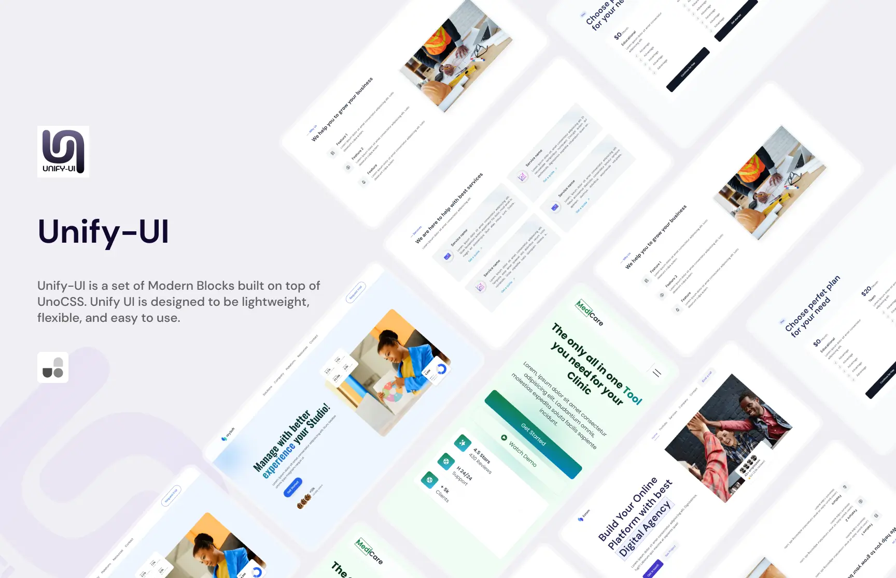

## 📝 Project Summary
 
- [ui](./ui/): Contains all UnifyUI blocks.
- [website](./website/): The main UnifyUI Kit.

## Contributing

If you're interested in contributing to Unify-UI, please read our [contributing docs](CONTRIBUTING.MD) before submitting a pull request.

## Request Component/Block

Request [here](https://docs.google.com/forms/d/e/1FAIpQLSfAlmv1bocO-XGoiPfEaWp0v5UzFLbjsLQbQuhIDHhM3V4JFQ/viewform?usp=pp_url)

## 📄 License

This project is licensed under the **MIT License** - see the [**MIT License**](https://github.com/unify-ui-dev/unocss-unifyui/blob/main/LICENSE) file for details.